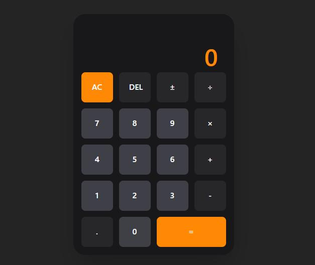

# 🧮 Vite Calculator

A minimal and responsive calculator built with **React**, **Vite**, and **Tailwind CSS**.  
Designed with a clean user interface and optimized for mobile-first use.

---

## 📸 Preview

---

## 🚀 Features

- Basic arithmetic operations (add, subtract, multiply, divide)
- Responsive layout (mobile-first design)
- Minimalist dark-themed UI
- Built with performance and simplicity in mind

---

## 🛠️ Tech Stack

- [React](https://react.dev/)
- [Vite](https://vitejs.dev/)
- [Tailwind CSS](https://tailwindcss.com/)
- [ESLint](https://eslint.org/)

---

## 👨‍💻 Author

**Sebastian Florez**  
Frontend Developer  

  <a href="https://www.github.com/Seb-fd" target="_blank">
    <picture>
      <source media="(prefers-color-scheme: dark)" srcset="https://raw.githubusercontent.com/danielcranney/readme-generator/main/public/icons/socials/github-dark.svg" />
      <source media="(prefers-color-scheme: light)" srcset="https://raw.githubusercontent.com/danielcranney/readme-generator/main/public/icons/socials/github.svg" />
      
    </picture>
  </a>
  <a href="https://www.linkedin.com/in/juan-sebastián-flórez-delgado-15263b311" target="_blank">
    <picture>
      <source media="(prefers-color-scheme: dark)" srcset="https://raw.githubusercontent.com/danielcranney/readme-generator/main/public/icons/socials/linkedin-dark.svg" />
      <source media="(prefers-color-scheme: light)" srcset="https://raw.githubusercontent.com/danielcranney/readme-generator/main/public/icons/socials/linkedin.svg" />
      
    </picture>
  </a>

